# Calora

Calora is a Flutter nutrition and wellness app for setting health goals,
logging food, tracking water and weight, reviewing daily progress, and
maintaining useful reminder routines.

The app uses Firebase Authentication for accounts, Cloud Firestore for
user-scoped data, Provider for dependency injection and UI state, and a
feature-first Flutter architecture. Its Material 3 interface follows the
companion `calora-design` HTML prototype, with locally bundled Inter and
Fraunces fonts.

## Features

- Email/password sign-up, login, password reset, sign-out, and secure account
  deletion.
- Guided onboarding for personal details, activity, wellness intent, units,
  and health goals.
- Home dashboard with calorie, macro, water, weight, meal, and daily-goal
  progress.
- Food diary for breakfast, lunch, dinner, and snacks.
- Manual food logging, custom foods, copied meals, barcode scanning, and Open
  Food Facts lookup.
- Water quick-add, custom entries, history, and configurable hydration goals.
- Weight logging, historical entries, target-weight summaries, and trends.
- Progress insights for calories, macros, water, and weight.
- Health-goal editing for calories, macros, water, target weight, and weekly
  weight change.
- Local meal, water, weight, and diary reminders with device permission
  handling and schedule synchronisation.
- Metric and imperial units, light and dark themes, CSV export, privacy,
  help, and profile settings.

## Tech Stack

| Area | Technology |
| --- | --- |
| App | Flutter and Dart |
| State and dependency injection | `provider` |
| Authentication | Firebase Authentication |
| User data | Cloud Firestore |
| Account deletion | Firebase Cloud Functions |
| Notifications | `flutter_local_notifications`, `timezone`, `flutter_timezone` |
| Food data | Open Food Facts |
| Scanning | `mobile_scanner` |
| Networking | Dio and `connectivity_plus` |
| Export sharing | `share_plus` |
| UI | Material 3, `flutter_screenutil`, Inter, Fraunces |

## State Management

Calora uses Provider for both dependency injection and UI-facing state.

- `appProviders` is the composition root for services and providers.
- `Provider<T>` registers stateless integrations such as Firebase, networking,
  notifications, and food-lookup services.
- `ChangeNotifierProvider<T>` registers mutable application state.
- `ChangeNotifierProxyProvider` binds user-scoped providers to the active
  authenticated profile.
- Widgets use `context.watch<T>()` to render state and `context.read<T>()`
  for actions.

Key providers:

- `AuthProvider`: authentication state, profile loading, onboarding, profile
  updates, sign-out, and account deletion.
- `ThemeProvider`: persisted light, dark, or system theme selection.
- `DiaryProvider`: diary entries, nutrition totals, and entry mutations.
- `ProgressProvider`: water and weight history plus progress mutations.
- `ReminderProvider`: reminder settings, permission requests, persistence, and
  device schedule synchronisation.
- `DataExportProvider`: CSV export state and errors.
- `BarcodeLookupProvider` and `ScannerProvider`: barcode-scanning workflows.

## Architecture

Calora follows a feature-first structure:

- `lib/main.dart` delegates startup to `bootstrap()`.
- `lib/app` owns app composition, routes, global providers, theme preferences,
  and the bottom navigation shell.
- `lib/core` owns feature-neutral theme tokens, models, networking, formatters,
  and reusable widgets.
- `lib/features/<feature>` owns feature-specific presentation, providers,
  models, and services.
- Services isolate Firebase, notifications, networking, and device SDKs.
- Providers coordinate asynchronous workflows and expose renderable state.
- Screens and widgets remain presentation-focused.
- Named routes are centralised in `AppRoutes` and built by `AppRouter`.

Dependency direction is intentionally one-way: `app` can compose features,
features can import `core`, and `core` never imports feature modules.

## Firebase And Data Layer

Firebase is initialised during bootstrap with
`DefaultFirebaseOptions.currentPlatform`. The checked-in
`lib/firebase_options.dart` contains the FlutterFire configuration for Android,
iOS, macOS, web, and Windows.

All product data is scoped beneath the signed-in user:

```text
users/{uid}
  diaryEntries/{entryId}
  waterEntries/{entryId}
  weightEntries/{entryId}
  settings/reminders
```

The user document itself stores profile and onboarding information. Firestore
rules restrict reads and writes to the authenticated owner of each `users/{uid}`
tree.

Account deletion is deliberately server-side. The callable function under
`functions/src/index.ts` recursively deletes the user’s Firestore tree and
deletes the matching Firebase Authentication user. The Firebase project must
have Cloud Functions enabled and deployed before this workflow can operate.

## Detailed Folder Structure

```text
calora/
├── assets/
│   └── fonts/                     # Bundled Inter and Fraunces font files
├── docs/
│   └── screenshots/               # README product-flow screenshots
├── functions/
│   ├── src/
│   │   └── index.ts               # Callable account-deletion Cloud Function
│   ├── package.json
│   └── tsconfig.json
├── lib/
│   ├── main.dart                  # Delegates application startup to bootstrap()
│   ├── firebase_options.dart      # Generated FlutterFire platform configuration
│   │
│   ├── app/                       # Application composition layer
│   │   ├── bootstrap.dart          # Firebase initialisation and startup boundary
│   │   ├── calora_app.dart         # Root MaterialApp, themes, and route wiring
│   │   ├── providers/
│   │   │   ├── app_providers.dart # Global MultiProvider composition
│   │   │   └── theme_provider.dart
│   │   ├── router/
│   │   │   ├── app_router.dart    # Named-route construction
│   │   │   └── app_routes.dart    # Central route constants
│   │   ├── services/
│   │   │   └── theme_preferences_service.dart
│   │   └── widgets/
│   │       └── main_bottom_navigation.dart
│   │
│   ├── core/                      # Feature-neutral, reusable foundation
│   │   ├── formatters/
│   │   │   └── measurement_formatter.dart
│   │   ├── models/
│   │   │   ├── daily_goal_status.dart
│   │   │   └── user_profile.dart
│   │   ├── network/
│   │   │   ├── network_client.dart
│   │   │   ├── network_connectivity_service.dart
│   │   │   └── network_exception.dart
│   │   ├── theme/
│   │   │   ├── app_colors.dart
│   │   │   ├── app_shadows.dart
│   │   │   ├── app_theme.dart
│   │   │   ├── app_tokens.dart
│   │   │   ├── app_typography.dart
│   │   │   └── theme_context.dart
│   │   └── widgets/
│   │       ├── calora_action_button.dart
│   │       ├── calora_brand_mark.dart
│   │       ├── calora_card.dart
│   │       ├── calora_choice_chip.dart
│   │       ├── calora_form.dart
│   │       ├── calora_labeled_field.dart
│   │       ├── calora_list.dart
│   │       ├── calora_metrics.dart
│   │       ├── calora_page.dart
│   │       ├── calora_screen_scaffold.dart
│   │       └── calora_sheet.dart
│   │
│   └── features/                  # Feature-first product modules
│       ├── auth/
│       │   ├── presentation/
│       │   │   ├── auth_validators.dart
│       │   │   ├── screens/
│       │   │   │   ├── forgot_password_screen.dart
│       │   │   │   ├── login_screen.dart
│       │   │   │   └── sign_up_screen.dart
│       │   │   └── widgets/
│       │   │       ├── auth_footer.dart
│       │   │       ├── auth_scaffold.dart
│       │   │       ├── auth_text_field.dart
│       │   │       ├── forgot_password_form.dart
│       │   │       ├── login_form.dart
│       │   │       └── sign_up_form.dart
│       │   ├── providers/
│       │   │   └── auth_provider.dart
│       │   └── services/
│       │       ├── account_deletion_service.dart
│       │       ├── auth_service.dart
│       │       └── user_profile_service.dart
│       ├── diary/
│       │   ├── models/
│       │   │   ├── diary_entry.dart
│       │   │   ├── diary_food_source.dart
│       │   │   ├── diary_nutrition_totals.dart
│       │   │   └── meal_type.dart
│       │   ├── presentation/
│       │   │   ├── screens/diary_screen.dart
│       │   │   └── widgets/
│       │   │       ├── diary_dashboard.dart
│       │   │       ├── diary_data.dart
│       │   │       ├── diary_day_section.dart
│       │   │       ├── diary_empty_meal.dart
│       │   │       ├── diary_empty_state.dart
│       │   │       ├── diary_entry_list.dart
│       │   │       ├── diary_food_action_button.dart
│       │   │       ├── diary_food_actions.dart
│       │   │       ├── diary_food_delete_sheet.dart
│       │   │       ├── diary_food_detail_row.dart
│       │   │       ├── diary_food_details_sheet.dart
│       │   │       ├── diary_food_item.dart
│       │   │       ├── diary_meal_card.dart
│       │   │       ├── diary_meal_header.dart
│       │   │       └── diary_summary.dart
│       │   ├── providers/diary_provider.dart
│       │   └── services/diary_service.dart
│       ├── food/
│       │   ├── models/
│       │   │   ├── custom_food_edit_arguments.dart
│       │   │   └── food_entry.dart
│       │   └── presentation/
│       │       ├── screens/
│       │       │   ├── add_food_screen.dart
│       │       │   ├── copy_meal_screen.dart
│       │       │   └── custom_food_screen.dart
│       │       └── widgets/
│       │           ├── add_food_quick_actions.dart
│       │           ├── add_food_results.dart
│       │           ├── add_food_search_field.dart
│       │           ├── add_food_tabs.dart
│       │           ├── copy_meal_empty_state.dart
│       │           ├── copy_meal_group.dart
│       │           ├── copy_meal_intro.dart
│       │           ├── custom_food_date_time_field.dart
│       │           ├── custom_food_date_time_fields.dart
│       │           ├── custom_food_form.dart
│       │           ├── food_entry_row.dart
│       │           ├── meal_add_food_button.dart
│       │           └── meal_card.dart
│       ├── home/
│       │   ├── models/home_dashboard.dart
│       │   ├── presentation/
│       │   │   ├── screens/home_screen.dart
│       │   │   └── widgets/
│       │   │       ├── home_calorie_summary.dart
│       │   │       ├── home_header.dart
│       │   │       ├── home_macros.dart
│       │   │       ├── home_meal_summary_card.dart
│       │   │       ├── home_meals_section.dart
│       │   │       ├── home_water_card.dart
│       │   │       └── home_weight_card.dart
│       │   ├── providers/home_provider.dart
│       │   └── services/home_dashboard_service.dart
│       ├── onboarding/
│       │   ├── presentation/
│       │   │   ├── screens/
│       │   │   │   ├── onboarding_screen.dart
│       │   │   │   └── splash_screen.dart
│       │   │   └── widgets/
│       │   │       ├── onboarding_activity_step.dart
│       │   │       ├── onboarding_calorie_target.dart
│       │   │       ├── onboarding_details_step.dart
│       │   │       ├── onboarding_footer.dart
│       │   │       ├── onboarding_goal_step.dart
│       │   │       ├── onboarding_header.dart
│       │   │       ├── onboarding_progress.dart
│       │   │       ├── onboarding_selection_card.dart
│       │   │       ├── onboarding_step_heading.dart
│       │   │       ├── onboarding_text_field.dart
│       │   │       ├── onboarding_units_step.dart
│       │   │       ├── onboarding_view.dart
│       │   │       ├── splash_actions.dart
│       │   │       └── splash_brand_content.dart
│       │   └── providers/onboarding_provider.dart
│       ├── profile/
│       │   ├── models/reminder.dart
│       │   ├── presentation/
│       │   │   ├── screens/
│       │   │   │   ├── goals_screen.dart
│       │   │   │   ├── help_support_screen.dart
│       │   │   │   ├── personal_details_screen.dart
│       │   │   │   ├── privacy_screen.dart
│       │   │   │   ├── profile_screen.dart
│       │   │   │   ├── reminders_screen.dart
│       │   │   │   └── units_screen.dart
│       │   │   └── widgets/
│       │   │       ├── account_reauthentication_sheet.dart
│       │   │       ├── goal_edit_sheet.dart
│       │   │       ├── goals_list.dart
│       │   │       ├── help_support_content.dart
│       │   │       ├── profile_account_actions.dart
│       │   │       ├── profile_confirm_action_sheet.dart
│       │   │       ├── profile_details_form.dart
│       │   │       ├── profile_details_summary.dart
│       │   │       ├── profile_identity_header.dart
│       │   │       ├── profile_page_header.dart
│       │   │       ├── profile_section.dart
│       │   │       ├── profile_theme_row.dart
│       │   │       ├── reminders_list.dart
│       │   │       ├── units_choice_cards.dart
│       │   │       └── water_reminder_sheet.dart
│       │   ├── providers/
│       │   │   ├── data_export_provider.dart
│       │   │   └── reminder_provider.dart
│       │   └── services/
│       │       ├── data_export_service.dart
│       │       ├── local_notification_service.dart
│       │       └── reminder_service.dart
│       ├── progress/
│       │   ├── models/
│       │   │   ├── progress_date_range.dart
│       │   │   ├── progress_goal_metrics.dart
│       │   │   ├── water_entry.dart
│       │   │   └── weight_entry.dart
│       │   ├── presentation/
│       │   │   ├── screens/
│       │   │   │   ├── progress_screen.dart
│       │   │   │   ├── water_screen.dart
│       │   │   │   └── weight_screen.dart
│       │   │   └── widgets/
│       │   │       ├── custom_water_sheet.dart
│       │   │       ├── daily_calorie_swipe_detector.dart
│       │   │       ├── log_weight_sheet.dart
│       │   │       ├── progress_filter_chips.dart
│       │   │       ├── progress_insights_card.dart
│       │   │       ├── progress_page_body.dart
│       │   │       ├── progress_trends_card.dart
│       │   │       ├── water_history_list.dart
│       │   │       ├── water_page_body.dart
│       │   │       ├── water_quick_add_buttons.dart
│       │   │       ├── water_ring_card.dart
│       │   │       ├── weight_history_list.dart
│       │   │       ├── weight_page_body.dart
│       │   │       ├── weight_summary_cards.dart
│       │   │       └── weight_trend_card.dart
│       │   ├── providers/progress_provider.dart
│       │   └── services/progress_service.dart
│       └── scanner/
│           ├── models/
│           │   ├── barcode_product.dart
│           │   ├── scan_item.dart
│           │   ├── scan_result_outcome.dart
│           │   └── scanner_request.dart
│           ├── presentation/
│           │   ├── screens/
│           │   │   ├── scan_results_screen.dart
│           │   │   └── scanner_screen.dart
│           │   └── widgets/
│           │       ├── barcode_camera_preview.dart
│           │       ├── scan_estimate_notice.dart
│           │       ├── scan_food_sheet.dart
│           │       ├── scan_items_list.dart
│           │       ├── scan_meal_picker.dart
│           │       ├── scan_nutrition_summary.dart
│           │       └── scanner_preview.dart
│           ├── providers/
│           │   ├── barcode_lookup_provider.dart
│           │   └── scanner_provider.dart
│           └── services/
│               ├── barcode_scanner_service.dart
│               └── food_product_lookup_service.dart
│
├── test/                          # Unit and widget tests mirroring app layers
│   ├── support/fake_auth_dependencies.dart
│   ├── account_deletion_service_test.dart
│   ├── app_test.dart
│   ├── auth_validators_test.dart
│   ├── calora_sheet_test.dart
│   ├── daily_goal_status_test.dart
│   ├── data_export_service_test.dart
│   ├── diary_food_item_test.dart
│   ├── diary_food_source_test.dart
│   ├── diary_provider_test.dart
│   ├── food_product_lookup_service_test.dart
│   ├── goals_list_test.dart
│   ├── home_dashboard_test.dart
│   ├── home_weight_card_test.dart
│   ├── measurement_formatter_test.dart
│   ├── network_client_test.dart
│   ├── onboarding_provider_test.dart
│   ├── profile_data_support_navigation_test.dart
│   ├── progress_date_range_test.dart
│   ├── progress_goal_metrics_test.dart
│   ├── progress_page_body_test.dart
│   ├── progress_provider_test.dart
│   ├── reminder_provider_test.dart
│   ├── theme_provider_test.dart
│   └── user_profile_test.dart
├── README.md
├── pubspec.yaml                   # Flutter SDK, package, font, and asset declarations
├── analysis_options.yaml
├── firebase.json                  # Firebase hosting/functions configuration
└── firestore.rules                # Per-user Firestore access rules
```

Within a feature, `presentation` owns screens and widgets, `providers` own
UI-facing state, `models` own immutable data, and `services` own external
boundaries.

## Screens And Navigation

Routes are defined in `lib/app/router/app_routes.dart`.

Primary routes include:

- `/` splash
- `/login`, `/sign-up`, and `/forgot-password`
- `/onboarding`
- `/home`, `/diary`, `/food/add`, `/food/copy-meal`, and `/food/custom`
- `/scanner` and `/scanner/results`
- `/progress`, `/progress/water`, and `/progress/weight`
- `/profile`, `/profile/goals`, `/profile/reminders`, `/profile/units`, and
  `/profile/personal-details`
- `/profile/privacy` and `/profile/help-support`

The signed-in main navigation exposes Home, Diary, Scan, Progress, and Profile.

## Getting Started

### Prerequisites

- Flutter SDK compatible with Dart `^3.12.2`
- Android Studio / Android SDK for Android development
- Xcode for iOS and macOS development
- A Firebase project configured with the matching platform applications

### Install

```sh
flutter pub get
```

### Run

```sh
flutter run
```

## Cloud Functions

Install and deploy the account-deletion function from the `functions` folder:

```sh
npm install
npm run build
firebase deploy --only functions:deleteAccount --project calora-shurashipai
```

Cloud Functions v2 requires a Firebase project with the required billing and
Google Cloud APIs enabled. Never commit service-account files, API keys, or
other private credentials.

## Notifications

Calora requests notification permission only when an enabled reminder needs
it. Reminder settings are persisted in Firestore; the actual pending local
notifications are created and replaced on the user’s device.

For iOS, test on a physical device and confirm that alerts, badges, and sounds
are permitted in **Settings → Notifications → Calora**. Battery saving, Focus,
and operating-system notification settings can suppress normal notification
alerts and sounds.

## Testing

The project includes unit, provider, service, and widget tests for auth,
onboarding, diary totals, progress, reminders, data export, scanner lookup,
formatting, themes, and routes.

Run all checks:

```sh
dart format lib test
flutter analyze
flutter test
```

Run a focused test while iterating:

```sh
flutter test test/reminder_provider_test.dart
```

## App screens

### Welcome, sign in, and onboarding

<table>
  <tr>
    <td>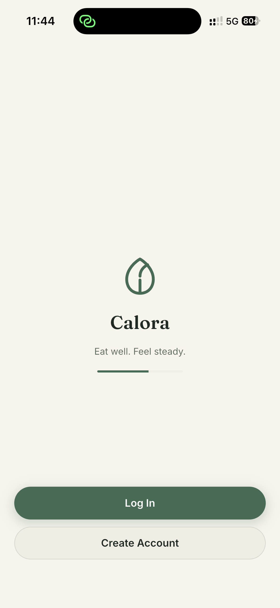</td>
    <td>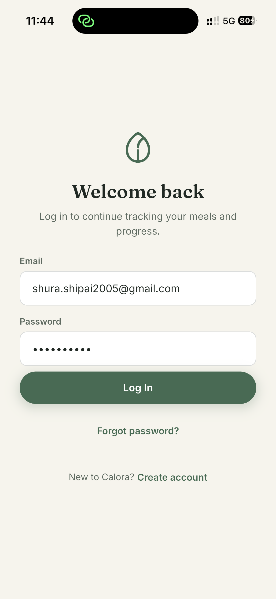</td>
    <td>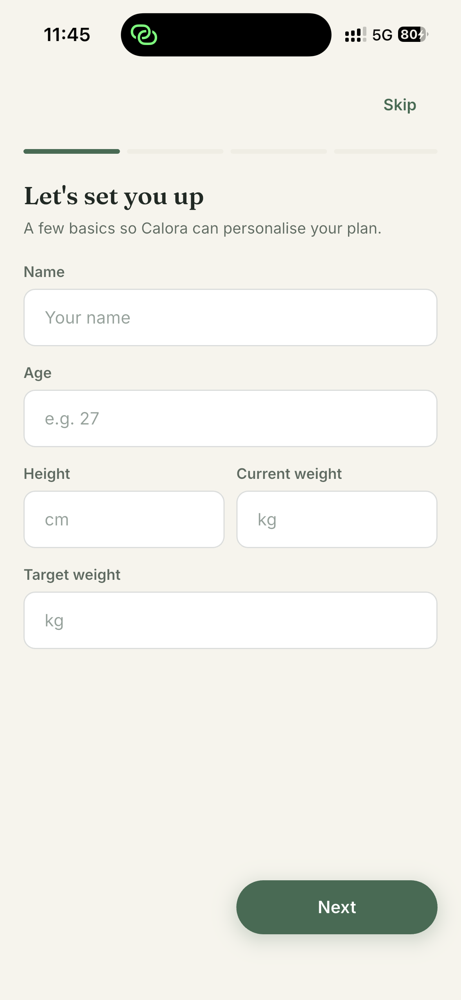</td>
    <td>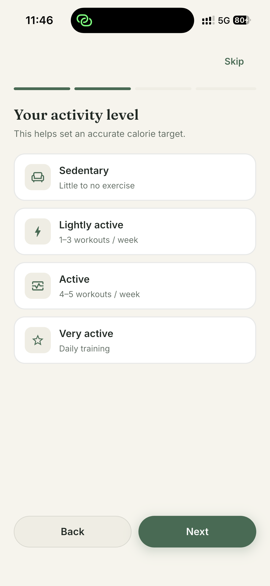</td>
    <td>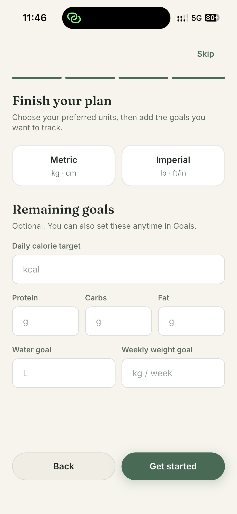</td>
  </tr>
</table>

### Daily tracking and diary

<table>
  <tr>
    <td>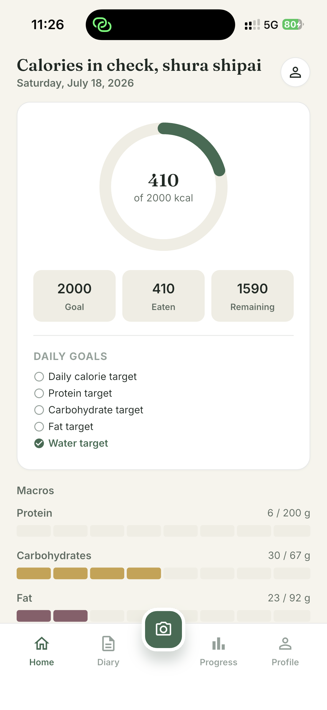</td>
    <td>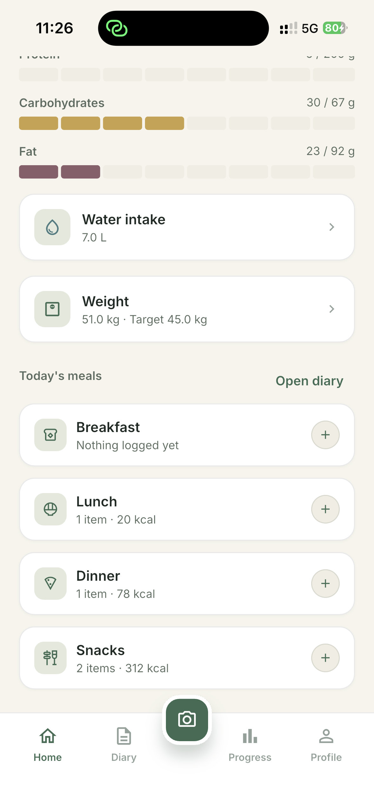</td>
    <td>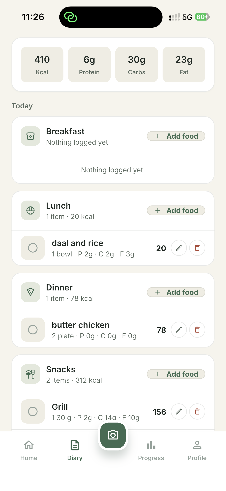</td>
    <td>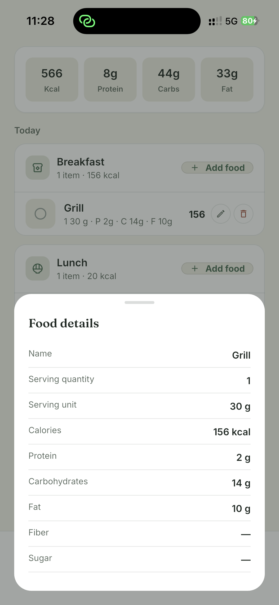</td>
  </tr>
</table>

### Scan and log food

<table>
  <tr>
    <td></td>
    <td>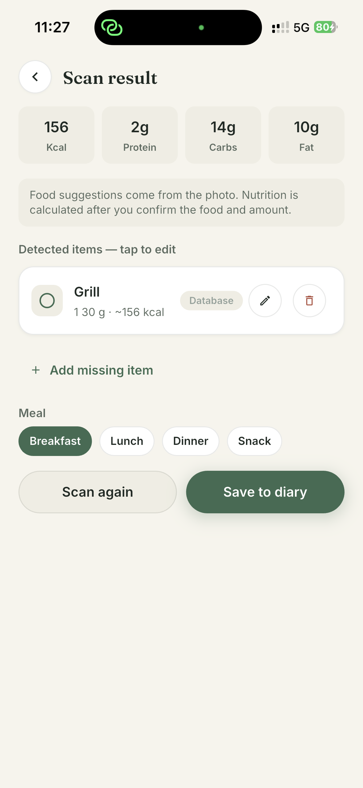</td>
    <td>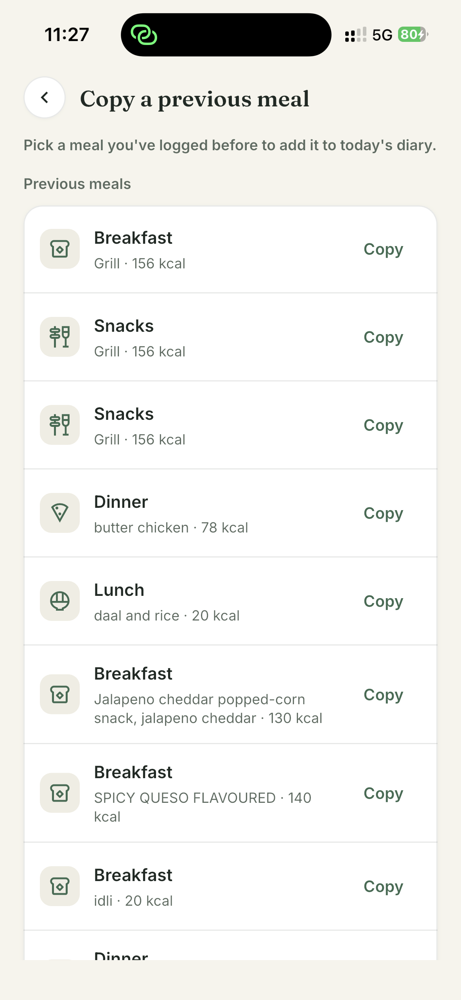</td>
    <td>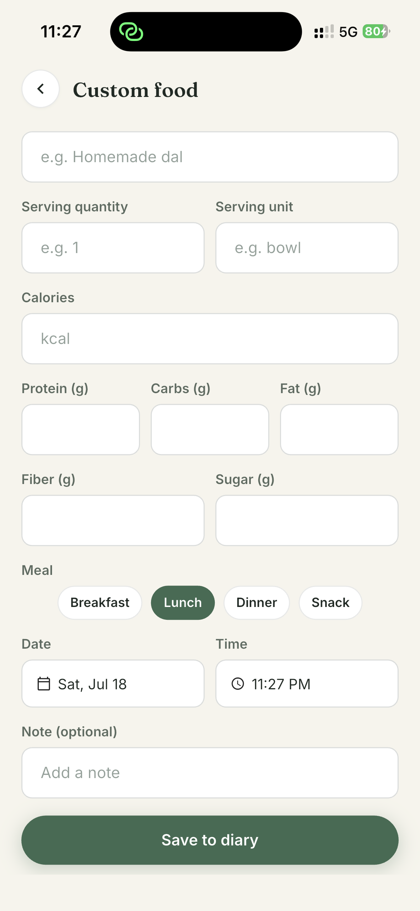</td>
  </tr>
</table>

### Progress and preferences

<table>
  <tr>
    <td>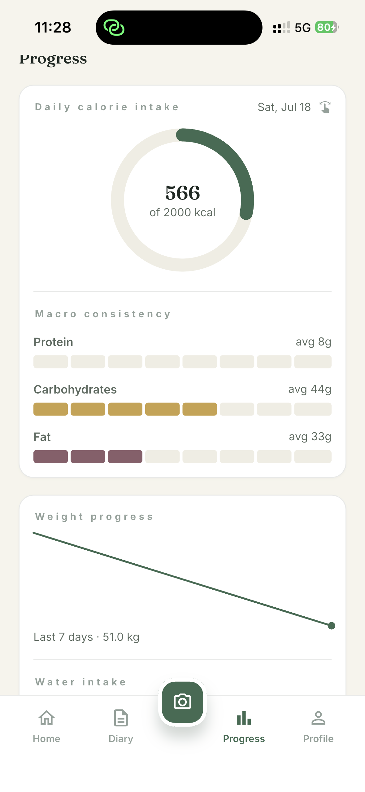</td>
    <td>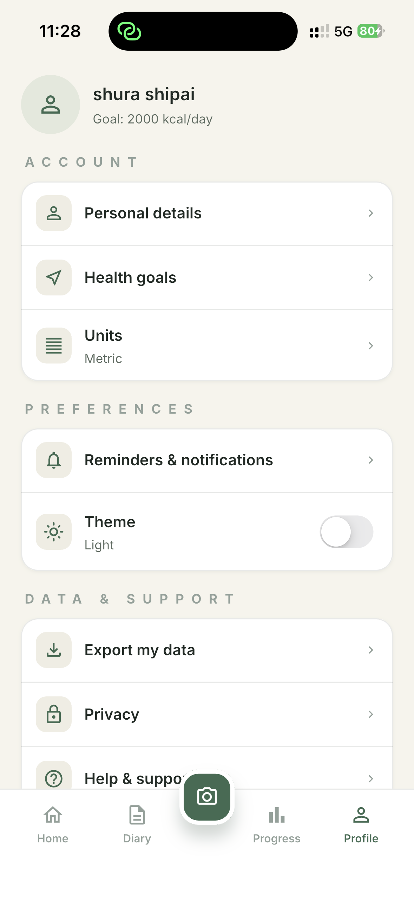</td>
    <td>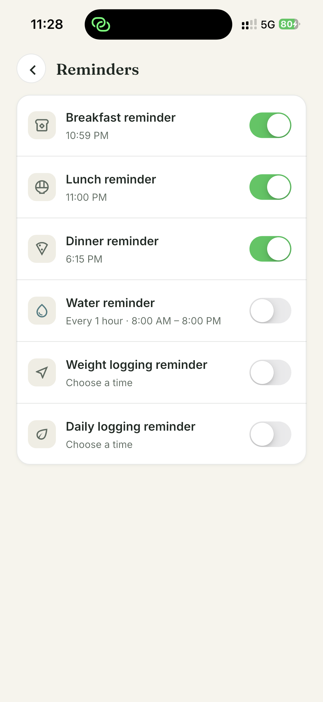</td>
  </tr>
  <tr>
    <td>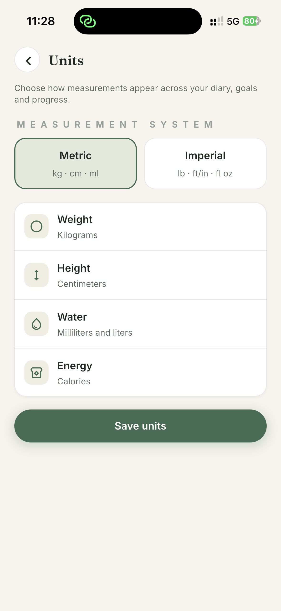</td>
    <td>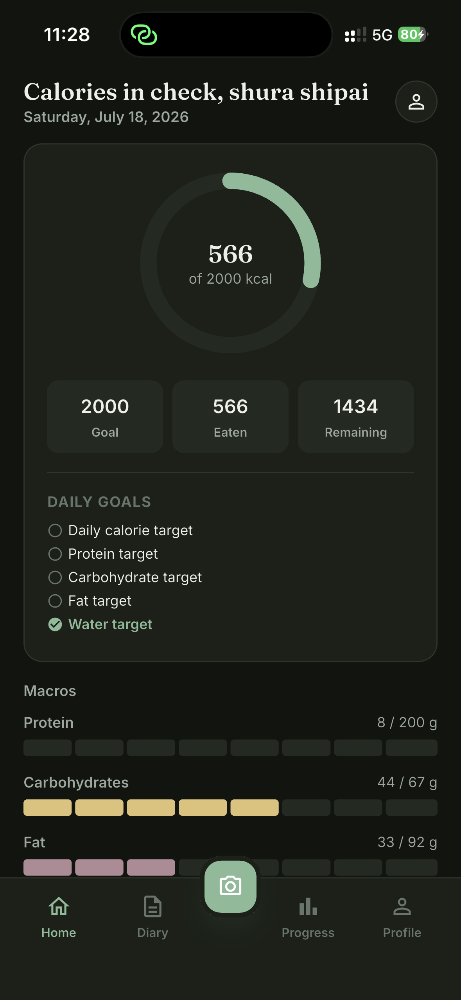</td>
    <td>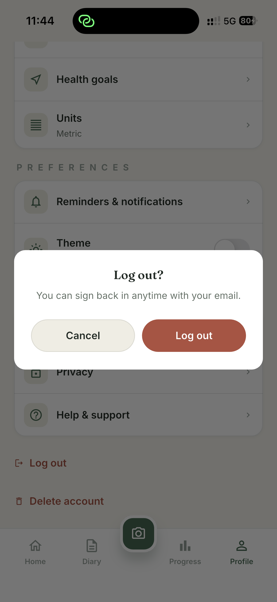</td>
  </tr>
</table>

## Contributing

Keep changes feature-owned, use the existing Calora tokens and shared widgets,
and add focused tests for new state or service behaviour. Do not construct SDK
services in widgets; place external calls in feature services and coordinate
them through providers.

## License

This repository is private (`publish_to: none`). Confirm the intended licence
before redistributing any part of the project.
